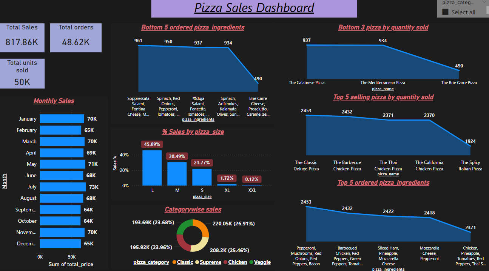
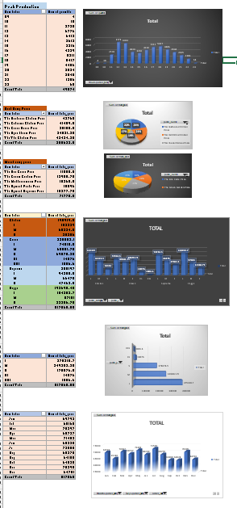

# 🍕 Pizza Sales Dashboard

Interactive dashboard project using **Excel**, **SQL**, and **Tableau** to analyze and optimize pizza sales performance.

---

## 📊 Project Overview

This project focuses on analyzing sales trends in a fictional pizza restaurant. The data was explored and visualized to uncover patterns in customer behavior, top-selling products, and operational efficiency.

---

## 🎯 Objectives

- Explore sales across pizza types, sizes, and days
- Calculate key KPIs: Total Revenue, Average Order Value, Top Products
- Identify peak sales hours and days for business optimization
- Build a Tableau dashboard with filters for interactive exploration

---

## 🧰 Tools Used

- **Excel** – Data cleaning, formatting, and basic analysis  
- **SQL** – Querying sales metrics and aggregations  
- **Tableau** – Dashboard development and storytelling  

---

## 📷 Dashboard Preview

---

## 📊 Supporting Excel Visuals

Here’s a sample of Excel-based visualizations used during the initial data exploration:

---

## 📂 Project Presentation

📽️ A PowerPoint summary of the dashboard insights is available for download:

➡️ [Download Pizza Sales Dashboard Analysis PPTX](Pizza_Sales_Dashboard_Analysis.pptx)

---

## 🔍 Key Insights

- **Large Pepperoni** is the highest-selling item by revenue  
- **Saturday evenings** see the highest order volumes  
- Targeted promotions during **weekdays** can boost average order value  
- **Veggie pizzas** perform well among medium-sized orders

---

## 📂 Project Structure

Pizza Sales Dashboard/
│
├── Excel/ # Raw and cleaned datasets
├── SQL_Scripts/ # SQL queries for insights
├── Tableau/ # .twbx Tableau dashboard file
├── Screenshots/ # Dashboard images
└── Pizza Sales Dashboard Analysis.pptx # Summary presentation

yaml
Copy
Edit

---

## 📫 Contact

**Shashank Bajpai**  
📧 [shashankax0@gmail.com]  
🔗 [LinkedIn Profile](www.linkedin.com/in/shashank-bajpai-53871222a)

---

Let me know if you'd like me to:
- Help update your `README.md` directly from this
- Auto-rename the repo (how-to)
- Prepare the next project (like stock analysis or ecommerce)

Happy to assist!
